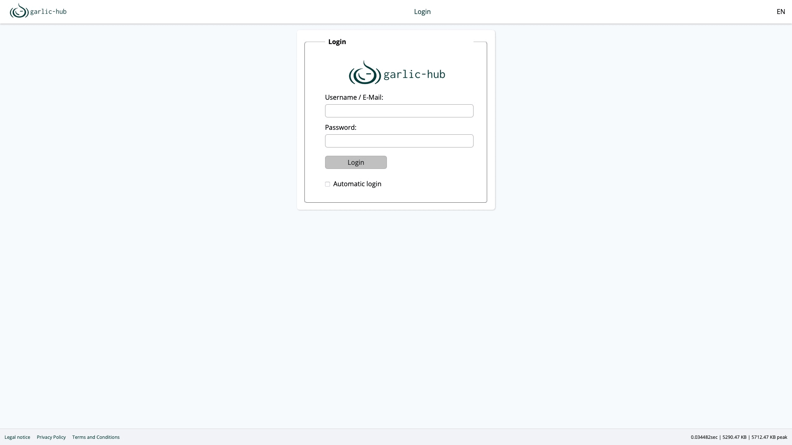

# Garlic-Hub: Smart Digital Signage Management

Garlic-Hub is a comprehensive Digital Signage Management solution that handles core CMS tasks alongside device management. From single-screen setups to distributed networks, it provides centralized control with flexibility for various signage environments.

## Live Demo
To see garlic-hub it in action, use the live demo at:

https://garlic-hub.com  
login: admin  
password: Demo1234!  

The environment is regularly deleted and rebuilt.

> **Feature Freeze: Currently Working on:**
>- fixing errors and testing

## Quick Start

- [User Installation Guide](docs/how-tos/install-user.md)
- [Connecting Media Players](docs/how-tos/connect-mediaplayer-user.md)

## Project Overview

### Edition Roadmap

Garlic-Hub is being developed in three phases, each delivering a distinct edition:

| Edition                  | Target Environment                 | Key Features                                                             | Status              |
|--------------------------|------------------------------------|--------------------------------------------------------------------------|---------------------|
| **Edge** (Phase 1)       | Single-device or small deployments | Basic media management, SMIL playlist creation, lightweight architecture | ✅ Release Candidate |
| **Core** (Phase 2)       | Mid-sized networks, NAS            | Limited device management, enhanced content creation                     | 🔄 Planned          |
| **Enterprise** (Phase 3) | Large-scale networks               | SaaS/on-premise, role-based permissions, advanced analytics              | 🔄 Planned          |

Each edition builds upon previous features, ensuring a smooth upgrade path as Garlic-Hub evolves into a comprehensive, SMIL-based digital signage solution.

### Current Features (Edge Edition)
| Section                  | Status | description                                                                                                                            |
|--------------------------|--------|----------------------------------------------------------------------------------------------------------------------------------------|
| **Core Framework**       | ✅      | Database, migrations, logging, routing, middleware and error handling with SLIM 4                                                      |
| **Initial admin user**   | ✅      | Set initial admin user after installation                                                                                              |
| **User management**      | ✅      | Basic user management                                                                                                                  |
| **Authentication**       | ✅      | Session-based login with remember-me functionality and basic OAuth2 token authorization                                                |
| **Media Management**     | ✅      | Hierarchical content organization with multi-source uploads (local, external links, screencasts, camera, stock platforms with API-key) |
| **SMIL Playlists**       | ✅      | Playlist management and export in industry-standard SMIL format                                                                        |
| **Push support**         | ✅      | Push playlist to a local player                                                                                                        |
| **Multi-Zone Content**   | ✅      | Graphic display zone editor                                                                                                            |
| **Conditional Play**     | ✅      | Define datetime conditions for media playback                                                                                          |
| **Trigger**              | ✅      | Trigger to play media or nested playlists by priority based on Accesskeys, Touch/Click, Datetime, and Network                          |
| **Multi-Zone Content**   | ✅      | Graphic display zone editor                                                                                                            |
| **Local Player Support** | ✅      | Integration with one local media player                                                                                                |
| **Internationalization** | ✅      | Locale-specific configurations and adaptable UI (English, Spanish, French, Russian, Greek, German)                                     |

### Coming In Future Releases 
- Online documentation
- Device management for remote configuration and monitoring
- Real-time reporting and system health monitoring
- Image templating engine
- Raspberry Pi Player / CMS Bundle
- Scalable deployment options

### Tech-Stack
- PHP 8.4 with strict types enabled 
- SLIM 4 Framework
- Phpstan Level 8 with 0 errors
- PHPUnit 12 with 99 % test coverage
- Vanilla JavaScript and external libraries
- Composer libraries

### Developer Documentation
- [Coding Standards](docs/coding-standards.md)
- [Installation](docs/install.md)
- [Exceptions](docs/exceptions.md)
- [DI-Container](docs/di-container.md)
- [CLI.php—Command Line Interface](docs/cli.md)
- [Api/Oauth2 - API and Oauth2](docs/oauth2.md)
- [User- Administration](docs/user-administration.md)
- [Connect Media Player](docs/connect-media-player.md)

# Contributing
Contributions are highly encouraged. As the project is in early development, please note that code, features, and documentation are subject to change as we evolve toward a production-ready state.

# License
Garlic-Hub is open-source software licensed under the [Affero GPL v3.0 License](https://www.gnu.org/licenses/agpl-3.0.en.html).

## Repository Structure Overview
Below is a quick reference to the most relevant files and folders in this repository to help you navigate the codebase.

- Caddyfile — Web server configuration used in containerized deployments.
- Dockerfile — Builds the application image used by Docker.
- docker-compose.yaml — Local development stack (app + services) orchestration.
- entrypoint.sh — Container entrypoint script used by the Docker image.
- dev-install.sh — Developer helper script to bootstrap the environment.
- getloc.sh — Utility to manage/update translation locales.
- preCommit.sh — Local Git pre-commit helper (linters, tests, etc.).
- LICENSE — Project license (AGPL-3.0).
- README.md — This file.
- composer.json / composer.lock — PHP dependencies definition and lock file.
- phpunit.xml — PHPUnit configuration.
- phpstan.neon — PHPStan static analysis configuration.

Directories
- bin/ — CLI entry points and scripts used by the application.
- config/ — Service definitions and configuration for modules and framework glue
  - Example: config/services/player.php registers Player services, controllers, repositories, and helpers in the DI container.
- docs/ — Project documentation, guides, and assets (e.g., screenshots, GIFs).
- migrations/ — Database migration files to evolve schema over time.
- misc/ — Miscellaneous assets (e.g., generated badges, reports).
- public/ — Public web root served by the web server (index.php, assets, JS/CSS).
- src/ — Application source code organized by Framework and Modules namespaces
  - Modules/Users — User management helpers and repositories
    - Helper/Settings/{Builder,Facade,Parameters,Validator}.php — User settings assembly, access, parameter definitions, and validation.
    - Repositories/Core — Persistent storage for user-centric aggregates (e.g., Stats, Contacts).
    - Repositories/Edge — Storage access for Edge edition user data (Acl, Main, Tokens).
  - Modules/Player — Player-related controllers, services, index creation, and repositories
    - Helper/Datatable — Builder, Parameters, Preparer, and Controller facade for datatable UIs.
    - IndexCreation — Builders to assemble Player index files, template selector, UA handling.
    - Services — Application services including PlayerService, PlayerIndexService, AclValidator.
    - Repositories — Persistence layer (PlayerRepository, PlayerTokenRepository, PlayerIndexRepository).
    - Controller — HTTP controllers like PlayerIndexController, PlayerPlaylistController.
  - Framework — Reusable framework components (routing, DI, utils, translator, etc.).
- templates/ — Server-side templates rendered by the Template Engine.
- tests/ — PHPUnit tests (unit/integration) covering framework and modules.
- translations/ — i18n message catalogs.
- var/ — Runtime cache, logs, and other generated artifacts.
- vendor/ — Composer-installed dependencies.
