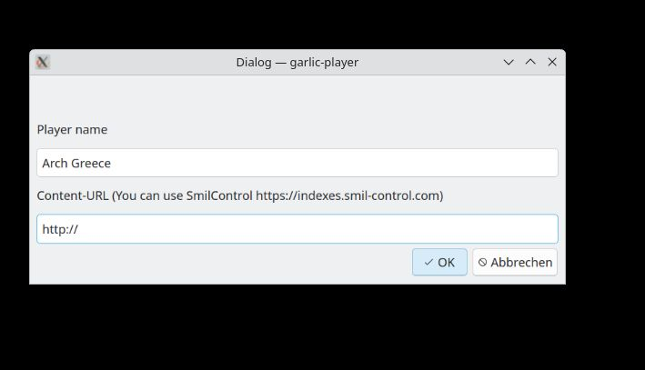
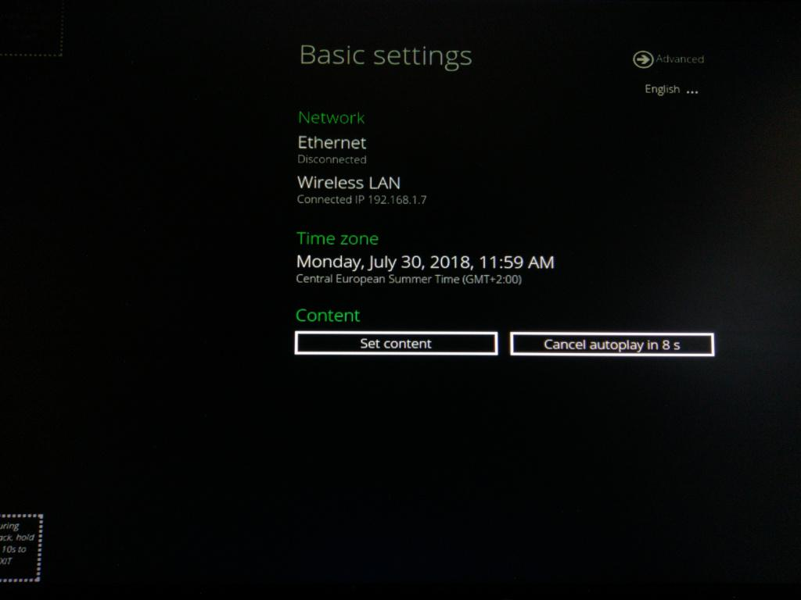
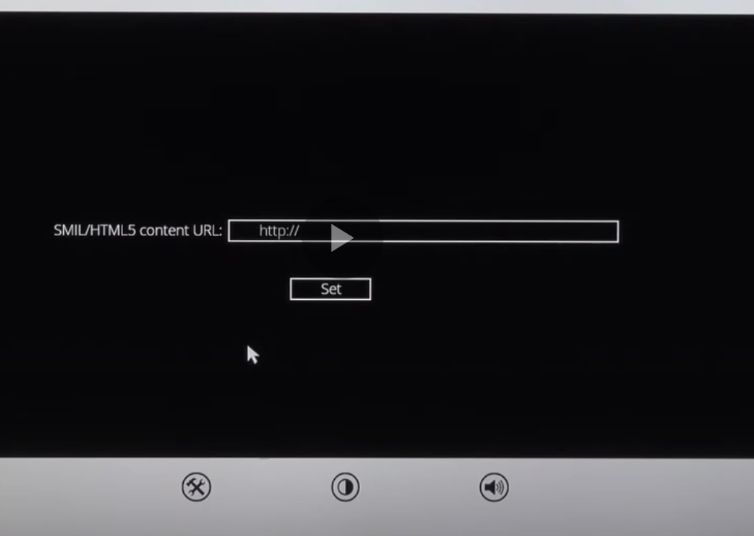

# Connecting a Digital Signage Player to Garlic-Hub

This guide walks you through connecting SMIL Media Players to Garlic-Hub. The process requires only configuring the content URL.

## 1. Prerequisites

| Component | Requirements |
|-----------|--------------|
| **Media Player** | One of the following compatible options: • [Garlic-Player (open source)](https://garlic-player.com/garlic-player/downloads) • [IAdea-Player](https://iadea.com) |
| **Garlic-Hub** | Access to `http://<your-domain>/smil-index` |
| **Network** | Connection between player and CMS |

## 2. Determining Your Content URL

Players require an index file to enable content playback. This index serves as a comprehensive guide that provides:
- Location of media files
- Destination for log data
- Other configuration details

Think of it as a table of contents that organizes and directs access to different sections. Our indexes use the standardized [SMIL](https://www.w3.org/TR/SMIL3/) multimedia language for consistent performance.

**Example:**
If Garlic-Hub is hosted at `http://localhost:8090`, your content URL will be: `http://localhost:8090/smil-index`

## 3. Connecting Your Player

### 3.1. Garlic-Player Connection

1. Connect a keyboard to your device and start the Garlic-Player
2. Press `Ctrl+S` to open the settings dialog
3. In the configuration screen that appears:
   
4. Enter your content URL (`http://<your-domain>:<port>/smil-index`) in the Content-URL field
5. Press Enter or click the OK button to save

### 3.2. IAdea-Player Connection

1. When the player starts, you'll see this opening screen for approximately 15 seconds:
   
2. Press "Set content" to access the configuration options
3. In the content URL configuration screen:
   
4. Enter your content URL (`http://<your-domain>:<port>/smil-index`) in the content-url field
5. Press the "Set" button to save your configuration

If the player is correctly recognized, Garlic-Hub will store its information in the player database. You will see it in the player overview. 